# ClustR  
### Clustering de Variables : K-means – Qualitatif – Deep Learning  
**Package R + Application Shiny**

---

## 📌 Présentation

**ClustR** est un package R dédié au **clustering de variables**, permettant de regrouper des variables similaires pour :

- réduire la dimension,  
- créer des variables synthétiques,  
- améliorer l’interprétation,  
- faciliter les modèles prédictifs.

Il intègre **trois algorithmes complémentaires** :

1. **ClustKMeansVar** — PCA + K-means réallocatif  
2. **ClustQualiVarclus** — MCA + rapport de corrélation η²  
3. **ClustDeepVar** — Autoencodeur + clustering dans l’espace latent  

---

# 🚀 1. ClustKMeansVar (K-means réallocatif)

Méthode inspirée de Vigneau & Qannari (2003).

## 🔹 Principe général  
Les variables sont regroupées selon leur corrélation avec la **synthetic variable** (PC1) du cluster.

Pour chaque cluster \(C_g\), la synthetic variable est :

  

avec :

  

où :  

  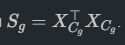

## 🔹 Distance variable–cluster  

  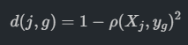

La variable \(X_j\) est affectée au cluster minimisant \(d(j,g)\).

## 🔹 Critère global optimisé  

  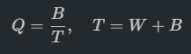

où :

- \(W\) = inertie intra-cluster  
- \(B\) = inertie inter-clusters  

💡 **Plus Q est proche de 1, meilleure est la partition.**

## 🔹 Algorithme complet  
1. Standardiser les variables  
2. Initialiser une partition  
3. Calculer PC1 de chaque cluster  
4. Réaffecter chaque variable au cluster optimisant \(d(j,g)\)  
5. Mettre à jour Q  
6. Répéter jusqu’à convergence  

---

# 🚀 2. ClustQualiVarclus (Clustering qualitatif par MCA + η²)

Méthode dédiée aux variables catégorielles basée sur l’ACM.

## 🔹 Étape 1 — Encodage disjonctif complet  

  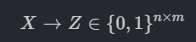

## 🔹 Étape 2 — MCA par cluster  
On réalise une analyse des correspondances multiples sur les modalités du cluster.

L’axe principal obtenu est \(Y_g\).

## 🔹 Étape 3 — Rapport de corrélation η²  

  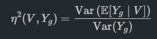

**Affectation :**

  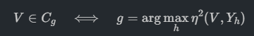

## 🔹 Algorithme complet  
1. Partition initiale des variables  
2. MCA pour chaque cluster  
3. Calcul de \(\eta^2(V,Y_g)\) pour chaque variable  
4. Réaffectation selon l’η² maximal  
5. Répéter jusqu’à convergence  

## 🔹 Atouts  
- Idéal pour variables nominales / ordinales  
- Basé sur la géométrie du χ²  
- Interprétation claire via l’ACM  

---

# 🚀 3. ClustDeepVar (Autoencodeur + clustering latent)

Algorithme deep learning pour capturer les **relations non linéaires** entre variables.

## 🔹 Étape 1 — Standardisation  

  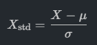

## 🔹 Étape 2 — Transposition  

  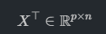

## 🔹 Étape 3 — Encodeur (embeddings)  

  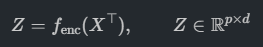

Chaque variable est représentée par un vecteur latent \(z_j \in \mathbb{R}^d\).

## 🔹 Étape 4 — Reconstruction  

  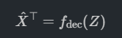

## 🔹 Projection de variables illustratives  

  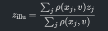

## 🔹 Étape 5 — Clustering des embeddings  

  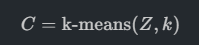

## 🔹 Soft clustering  

  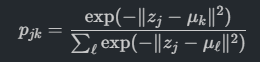

## 🔹 Projection de variables illustratives  

  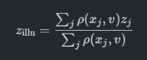

---

# 📊 Fonctions principales de l’application Shiny

### ✔ Chargement de données  
- Jeux intégrés  
- Upload CSV / TSV / XLSX  
- Détection automatique des types et NA  

### ✔ Sélection des variables  
- Actives vs illustratives  
- Détection automatique des variables redondantes  
- Matrice de corrélation  

### ✔ Choix de l’algorithme  
- Détection automatique selon le type de données  
- Réglages :  
  - `n_clusters`  
  - `latent_dim`, `epochs`, `dropout` (deep)  

### ✔ Visualisations  
- PCA (KMeans)  
- MCA (Quali)  
- Embeddings 2D/3D (Deep)  
- Heatmaps, distances inter-clusters  
- η², inerties, silhouette  

### ✔ Nouvelles variables  
- Numériques : somme / moyenne / ratio / produit / max/min  
- Qualitatives : combinaison, ifelse factor, quantiles  
- Projection dans PCA, MCA ou latent space  
- Soft membership complet  

---

# 👥 Auteurs

- **Riad SAHRANE**  
- **Aya MECHERI**  
- **Thibaud LECOMTE**  
Encadrant : **Ricco Rakotomalala**

---

# 🏁 Statut du projet

- ✔ Package R complet  
- ✔ Application Shiny avancée  
- ✔ Visualisations interactives  
- ✔ Nouvelles variables (num & quali)  
- ✔ Documentation complète  
